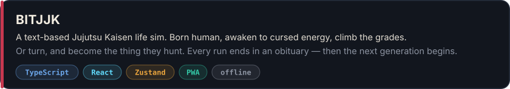
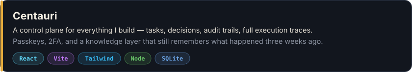
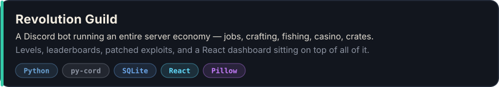

Hey, I'm Mico.

First program I ever wrote was a Python calculator that could barely add. I was a kid and I thought it was the coolest thing in the world. Still chasing that, just with bigger messes now.

### now

TypeScript and React most days. Building a Discord bot with a full server economy, a control plane to keep my own projects straight, and some Roblox and Blender things on the side.

### stack

### projects

### elsewhere

