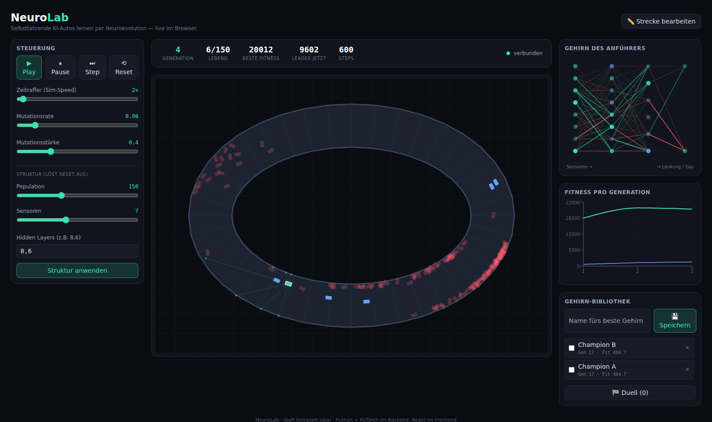

# NeuroLab

Autos, die sich selbst beibringen eine Strecke zu fahren. Es gibt kein vortrainiertes
Modell, das Netz fängt bei null an und wird über Generationen besser (genetischer
Algorithmus). Das Backend rechnet die Simulation, das Frontend zeigt sie live.



## Was es macht

Am Anfang fahren die Autos zufällig und crashen sofort. Nach ein paar Generationen fahren
sie die Strecke ab. Während es läuft kann man fast alles verstellen: Tempo, Mutationsrate,
Größe der Population, Anzahl der Sensoren und die Größe des Netzes.

Man kann ausserdem eine eigene Strecke malen, das beste Auto abspeichern und gespeicherte
Autos gegeneinander fahren lassen (Duell-Modus). Rechts sieht man das Netz vom gerade besten
Auto und einen Graphen mit der Fitness pro Generation.

Läuft komplett lokal.

## Aufbau

`backend/` ist Python (FastAPI, PyTorch, numpy). Physik und Sensoren sind mit numpy
vektorisiert, damit alle Autos in einem Rutsch berechnet werden. Die ganze Population steckt
in ein paar Tensoren und läuft durch ein einziges `bmm`. Gelernt wird per Evolution: die
besten bleiben, der Rest wird aus zwei Eltern gemischt und leicht mutiert.

`frontend/` ist React + TypeScript mit Vite. Die Arena ist ein Canvas, der Rest sind normale
Komponenten. Die Verbindung läuft über einen WebSocket, die Snapshots kommen ca. 30x pro
Sekunde.

## Starten

Backend:

```bash
cd neurolab/backend
python3 -m venv .venv
source .venv/bin/activate
pip install -r requirements.txt
uvicorn app.main:app --port 8000
```

Frontend (anderes Terminal):

```bash
cd neurolab/frontend
npm install
npm run dev
```

Dann `localhost:5173` aufmachen.

## Kurz testen ob das Lernen klappt

```bash
cd neurolab/backend
source .venv/bin/activate
python -m scripts.verify
```

Das trainiert ein paar Generationen ohne Browser und meckert, wenn die Fitness nicht steigt.

## Todo / Ideen

- andere Spiele (Snake, oder laufende Figuren mit Physik)
- mal PPO statt Evolution ausprobieren
- mehrere Strecken, Bestenliste, Replays
